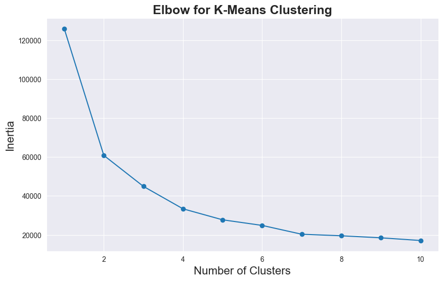
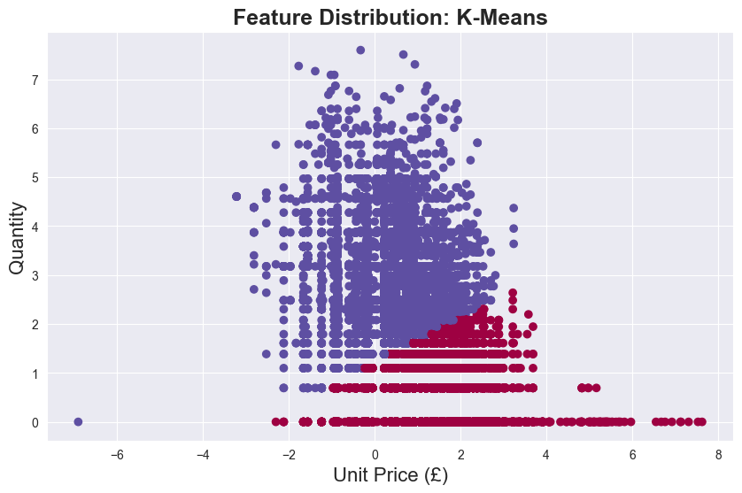
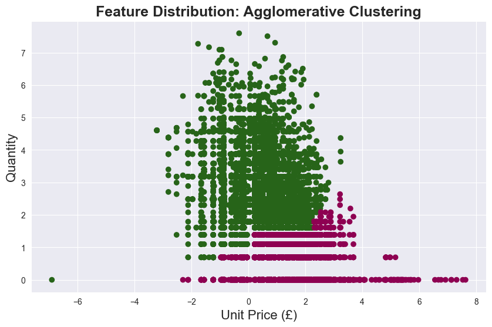
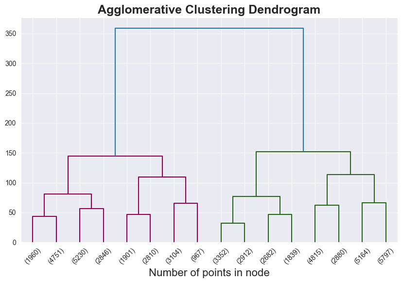

##### Thursday the 12th of September, 2024
# Customer Segmentation with Unsupervised Learning Models

## Introduction
### Background

Customer segmentation is the process of dividing a customer base into distinct groups based on shared characteristics such as demographics, behaviors, or preferences. Machine learning is useful for customer segmentation because it can analyze vast amounts of customer data quickly, identifying hidden patterns and insights that are difficult to detect manually. 

By leveraging algorithms, businesses can create more precise, data-driven segments based on complex behaviors and preferences, enabling more personalized marketing, better customer experiences, and improved business strategies. Consequently, this allows for more efficient allocation of resources, and in turn, increases profitability. Additionally, by catering to each group's unique characteristics, businesses can ultimately drive higher engagement, loyalty, and revenue growth. 

### Objective

The goal of this project is to perform customer segmentation by analyzing customer data using various clustering algorithms. The algorithms to be compared are K-Means, DBSCAN, and AgglomerativeClustering.

----
## Dataset description
The [Online Retail](https://archive.ics.uci.edu/dataset/352/online+retail) dataset used in this project contains transactions occurring between December 1, 2010 and December 9, 2011 for a UK-based and registered non-store online retail business. According to the UC Irvine Machine Learning Repository from which the data was retrieved, the company mainly sells unique all-occasion gifts, with many of their customers being wholesalers. credit card transaction records for European customers in 2023. It comprises 541,909 records and 6 features: Description, Quantity, InvoiceDate, UnitPrice, CustomerID, and Country.

| **Column Name** | **Description**                         |
| :-------------  | :--------------------------------------:|
| Description     | Written description of merchandise item |
| Quantity        | Number of items purchased               |
| InvoiceDate     | Date and time of purchase               | 
| UnitPrice       | Price per unit of merchandise           |
| CustomerID      | Unique ID per customer                  |
| Country         | Country of customer                     |

---
## Import Python Modules

First, we import the libraries/modules that will be used in this project:

- pandas
- numpy
- matplotlib
- seaborn
- Scikit-learn
- scipy

---
## Load the Data

Let's start by loading the dataset `e-commerce.csv` into a dataframe and previewing the first 5 rows of data.

<table border="1" class="dataframe">
  <thead>
    <tr style="text-align: right;">
      <th></th>
      <th>InvoiceNo</th>
      <th>StockCode</th>
      <th>Description</th>
      <th>Quantity</th>
      <th>InvoiceDate</th>
      <th>UnitPrice</th>
      <th>CustomerID</th>
      <th>Country</th>
    </tr>
  </thead>
  <tbody>
    <tr>
      <th>0</th>
      <td>536365</td>
      <td>85123A</td>
      <td>WHITE HANGING HEART T-LIGHT HOLDER</td>
      <td>6</td>
      <td>12/1/2010 8:26</td>
      <td>2.55</td>
      <td>17850.0</td>
      <td>United Kingdom</td>
    </tr>
    <tr>
      <th>1</th>
      <td>536365</td>
      <td>71053</td>
      <td>WHITE METAL LANTERN</td>
      <td>6</td>
      <td>12/1/2010 8:26</td>
      <td>3.39</td>
      <td>17850.0</td>
      <td>United Kingdom</td>
    </tr>
    <tr>
      <th>2</th>
      <td>536365</td>
      <td>84406B</td>
      <td>CREAM CUPID HEARTS COAT HANGER</td>
      <td>8</td>
      <td>12/1/2010 8:26</td>
      <td>2.75</td>
      <td>17850.0</td>
      <td>United Kingdom</td>
    </tr>
    <tr>
      <th>3</th>
      <td>536365</td>
      <td>84029G</td>
      <td>KNITTED UNION FLAG HOT WATER BOTTLE</td>
      <td>6</td>
      <td>12/1/2010 8:26</td>
      <td>3.39</td>
      <td>17850.0</td>
      <td>United Kingdom</td>
    </tr>
    <tr>
      <th>4</th>
      <td>536365</td>
      <td>84029E</td>
      <td>RED WOOLLY HOTTIE WHITE HEART.</td>
      <td>6</td>
      <td>12/1/2010 8:26</td>
      <td>3.39</td>
      <td>17850.0</td>
      <td>United Kingdom</td>
    </tr>
  </tbody>
</table>

We drop the `CustomerID`, `InvoiceNo`, `Country`, `InvoiceDate`, and `StockCode` columns from the dataframe as they are not significant for this analysis, and the `Description` column as it is redundant while the `StockCode` column is present. 

We also opt to sample a subset from the dataset, as it is too resource-intensive to perform hyperparameter tuning on the dataset with >500,000 entries. We do this using the Pandas `.sample()` method with a value of `frac = 0.1`, which specifies that we take a random sample constituting 10% of the original dataset.

---
## Exploratory Data Analysis

### Distributions of Features
To visualize the distribution of each numeric feature, we plot a histogram matrix
#### Plotting Histogram Matrix
The `Quantity` and `UnitPrice` columns needed to be log transformed prior to plotting as the data was so left-skewed that only a small portion of the distributions were visible. 
    

### Plotting Feature Distribution
    

---
## Model Training
### K-Means Clustering
#### Elbow Method for Determining k

    

Based on the visualization above, the optimal value of k is 2. We will create a `KMeans` object with `num_clusters = 2`

We plot the feature distribution with K-Means clusters

    

    

### DBSCAN Algorithm

We create a `DBSCAN` object and then plot the feature distribution again, but this time with the clusters prescribed by the `DBSCAN` function. 
    

    
    

### Agglomerative Clustering

Lastly, we create an `AgglomerativeClustering` object and then plot the feature distribution for the final time, this time with the clusters prescribed by the `AgglomerativeClustering` function. 

We will also use a dendrogram to supplement the visualization above by showing the ward linkage behind the determination of the clusters. 
    

    

---
## Algorithm Comparison

<table border="1" class="dataframe">
  <thead>
    <tr style="text-align: right;">
      <th></th>
      <th>Model Name</th>
      <th>Silhouette Score</th>
      <th>Davies-Bouldin Score</th>
    </tr>
  </thead>
  <tbody>
    <tr>
      <th>0</th>
      <td>K-Means</td>
      <td>0.455926</td>
      <td>0.831467</td>
    </tr>
    <tr>
      <th>2</th>
      <td>Agglomerative Clustering</td>
      <td>0.449886</td>
      <td>0.843817</td>
    </tr>
    <tr>
      <th>1</th>
      <td>DBSCAN</td>
      <td>0.311628</td>
      <td>2.370093</td>
    </tr>
  </tbody>
</table>

As shown in the table above, the K-Means algorithm has the greatest silhouette score, followed by Agglomerative Clustering and then DBSCAN algorithms. This suggests that the algorithm that produced the best clustering is the K-Means algorithm, as a higher value indicates better clustering (better separation and compactness). 

The opposite is true for the algorithms' Davies-Bouldin scores: the DBSCAN algorithm has the greatest Davies-Bouldin score, followed by Agglomerative Clustering and then K-Means algorithms. Just as with the silhouette score, the Davies-Bouldin scores suggest that the algorithm that produced the best clustering is the K-Means algorithm, as a lower value indicates better clustering. 

In summary, the scores above indicate that the ***K-Means algorithm is the best-suited*** for the task at hand. 

---
# Discussion
The K-Means algorithm is well-suited for the object of segmenting customers based on the consumer data metrics of quantity and unit price. In this application, the clusters are few in number and relatively similar in size. In combination with the flat geometry of our data, this suggests that the Agglomerative Clustering and DBSCAN algorithms would not be as suitable as the K-Means algorithm. This is supported by the silhouette scores and Davies-Bouldin scores, which further indicate that the K-Means algorithm produces the best results for our data.

The next step in the analysis of this data is to perform further hyperparameter tuning on our K-Means algorithm model to optimize its performance. We could also likely benefit from using a larger subset of the initial dataset, or even the entire dataset; however, this would be much more resource-intensive and would take a long time to execute. 
